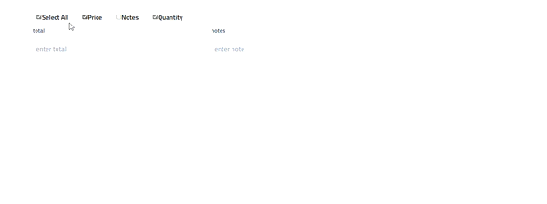

# inputs show toggle with CheckBox 

## Description

this package for making toggle checkbox to show or hide input
## Installation

Provide step by step series of commands and procedures on how to install the project.

```bash
npm i inputs-checkbox-toggle
```
## Usage

After installing the package, you can import it into your project and use it to create a toggle checkbox. 
for a basic example look at:  [this simple example](https://github.com/mahmoudbahaa755/inputs-checkbox-toggle/blob/main/src/example/example.tsx)

